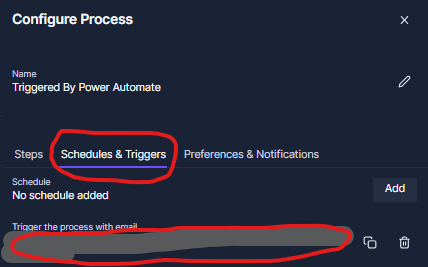
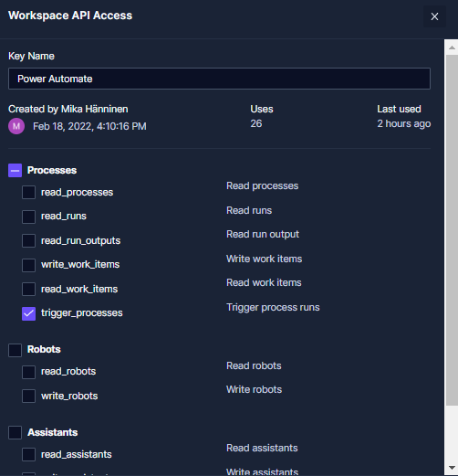

# Power Automate triggering a Process in Robocorp Control Room

This example will use Microsoft Power Automate flow to monitor new items
on Sharepoint list and on each new item will trigger a Robocorp Control Room
process with email.

## About Sharepoint list item details

This example will read Sharepoint list `Item` contents from the email body of
the received trigger email. This is not the most secure way, because data is
included in the email.

Alternative approach would be to send link to Sharepoint `Item` and Robot
would access that via MSGraph API.

## Steps

Assumption: You have some Sharepoint list which benefits from this Robot.

1. Create a Robocorp Robot task which will execute on email trigger
2. Configure a process in Robocorp Control Room
3. Configure a flow in the Microsoft Power Automate

### Step 1. Create a Robocorp Robot task which will execute on email trigger

The Power Automate sends email body as HTML and it can't be configured to plain text.
Due to this restriction we will be sending item from Power Automate within placeholder texts to identify `Item` in the email body.
The `Item` will be placed between **ITEMBODYSTART** and **ITEMBODYEND** texts (this will happen at step 3.)

Robot is using custom library (``SharepointLibrary.py``) to get the `Item` from the email and
``RPA.Robocorp.WorkItems`` library to read work item variable `parsedEmail` which is a variable
automatically provided by the library when Work Item has been triggered with email.
The `parsedEmail` contains all email fields, but in this example we will using only `Body`
field.

Robot will then output all the key-value pairs of the Sharepoint Item.

### Step 2. Configure a process in Robocorp Control Room

Upload Robot to your Robocorp Control Room Workspace. Create new process into Control Room and from `Configure Process` add a step
executing ``Power Automating`` task of this Robot. Still in the `Configure process` switch to `Schedules & Triggers` and add
`Trigger the process with email` - this will generate unique email address which can be used to trigger this Process with an email.
Make a copy of the email address as it is needed when we will in the next step configure Power Automate.




Link. [https://cloud.robocorp.com](https://cloud.robocorp.com)

### Step 3. Configure a flow in the Microsoft Power Automate

Create a flow into Microsoft Power Automate. You can start with the blank flow. The flow consists of three steps.

**Step 3.1.** Sharepoint. **"When an item is created"**. This step requires that we will configure Sharepoint site address and the name of the list.

**Step 3.2.** Sharepoint. **"Get item"**. This step requires that we will configure Sharepoint site address, the name of the list and the Id of the Item
(for the Id we will be using the ID from step 1). The Body returned by "Get Item" is a dictionary containing all fields in the Item.

**Step 3.3.** Email. **"Send an email notification (V3)"**. This step requires that we will configure `To` address (put here the Robocorp Process trigger email
address from Step 2), `Subject` can be anything because our Robot is not using that information and in the `Body` place the `Body` from step 3.2 "Get Item"
between placeholder texts.


Link. [https://flow.microsoft.com](https:/flow.microsoft.com)

## Control Room step run result (log.html)


## (ALTERNATIVE) Robocorp Power Automate custom connector

This method can be used to launch Robocorp Process via API with Power Automate custom connector.

Import attached JSON file as a custom connector into Power Automate. Connector contains at the moment
two actions:

- Trigger Process with single workitem
- Trigger Process with multiple workitems

Difference between actions is that process with single workitem expects `body` content as a dictionary and will launch 1 Process step run in the Robocorp Control Room with the given
input work item.

The process with multiple workitems expects `body` content be given multiple workitems in a list (list of dictionaries), which will trigger multiple Process step runs each with different input work item.

[Robocorp-Process-API.swagger.json](Robocorp-Process-API.swagger.json)

### Get Robocorp Control Room API key


Set name for the permission and add `trigger_processes` permission.



On the first launch the Power Automate Connection must be created with the Robocorp Control Room
API key. Give Connection some easy to remember name so that you can identify it from your other
Power Automate Connections.


API Key must be inserted in the following format:

```shell
RC-WSKEY <COPY OF CONTROL ROOM API TOKEN IN HERE>
```

Notice the SPACE character between `RC-WSKEY` and the token.

### Power Automate step configuration

The selected action needs 3 configuration parameters set.

1. **workspace_id** - this can be get from Robocorp Control Room settings
2. **process_id** - this can be get from Robocorp  Control Room process
3. **body** - this is a work item content which for `Trigger Process with single workitem` action needs
to be a dictionary, and for `Trigger Process with multiple workitems` action needs to be list
of dictionaries.

### About `body` content

For `Trigger Process with single workitem` action `body` can be given empty dictionary ``{}`` to indicate that process
is started with empty work item.
